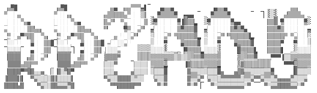

---

RP2A03 Synth is a WiP NES VST3/CLAP plugin for modern DAWs, The goal is to have a "modernized" version of Matt Montag's NES VST by focusing on faithful, hardware-accurate APU behavior and support for NES expansion audio chips.

**Crates in this workspace**

- `rp2a03_core` — Core NES APU DSP: channels, timers, frame sequencer and BlipBuf integration.
- `rp2a03_common` — Shared utilities and types used across crates.
- `rp2a03_nih` — Plugin crate (CLAP / VST3) exposing the synth (`NES Multi-Synth`). See [rp2a03_nih/src/lib.rs](rp2a03_nih/src/lib.rs).
- `xtask` — Workspace helper tasks and build automation.

**Building**

Prerequisites: Rust toolchain (stable, 2021 edition), development toolchain for target plugin formats if needed.

Build the whole workspace (release):

```
cargo build --release
```

Build only the plugin crate:

```
cargo build --release -p rp2a03_nih
```

Release artifacts and bundled plugin outputs can be found under `target/` (for example `target/bundled/` and `target/release/`).


**License**

This project includes a `LICENSE` file. See [LICENSE](LICENSE) for license terms.

**Credits & Attribution**

This project was developed with significant reference to the MesenCE project. Code was translated from MesenCE into Rust during implementation; the code here is a reimplementation rather than a verbatim copy. Please see the original project for the primary reference and upstream work:

- MesenCE: https://github.com/nesdev-org/MesenCE

# AI Disclosure

OpenAI's Codex was used in the development of this plugin.