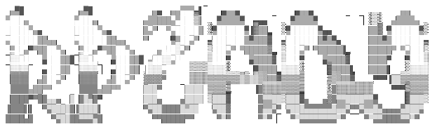

---

**RP2A03 Synth** is a WiP NES synthesizer plugin for modern DAWs.

The sound engine is not a sample library or an approximated "chiptune" waveform
generator — it is a register-level emulation of the NES RP2A03 APU, driven
directly by MIDI and host automation. Envelope, sweep, frame counter, length
counter, and timer behavior are modeled the way an emulator models them, so the
plugin reproduces the actual quirks of the hardware (4-bit volume steps,
duty-cycle phase-reset behavior, real timer-derived pitch resolution) instead of
approximating them — though some deliberate liberties were taken for the sake of
flexibility, see [Accuracy & Creative Liberties](#accuracy--creative-liberties).

Beyond the stock 2A03 channels (two pulse, triangle, noise), the plugin also
emulates the Konami **VRC6** (More soon!)
On top of the emulation core sits a FamiTracker-style sequence engine
(volume / arpeggio / pitch / hi-pitch / duty sequences with loop and release
points) plus software vibrato/tremolo LFOs, so the instrument plays and automates
like a normal synth while the audio math underneath stays somewhat hardware-accurate.

# Synth Showcase
### Cover of Snail House's "SUNNY" by [recme](https://github.com/recm3)
https://github.com/user-attachments/assets/b758d92e-7e35-460d-8dde-89ff16a07951


### Cover of "The Brilliant Truth (Mina The Hollower)" by Me (Purpbatboi)
https://github.com/user-attachments/assets/d7d7984e-a96e-4002-8f1c-d2bf56444ee7


## Features

- **Register-level 2A03 emulation** — pulse 1/2, triangle, noise, with real
  envelope, sweep, length counter, linear counter, and frame-counter behavior.
- **VRC6 expansion audio** — VRC6 pulse (8 duty settings plus the DDA/PCM
  "ignore duty" mode) and VRC6 sawtooth.
- **Band-limited output** — Blargg-style `blip_buf` synthesis resamples from the
  APU clock down to the host sample rate without aliasing.
- **FamiTracker-style sequencer** — 5 sequence types × 128 slots, with loop (`|`)
  and release (`/`) markers, `ArpMode` (absolute/fixed/relative), `PitchMode`,
  and `VolMode` step handling. Adjustable step rate (1–600 Hz, default 60).
- **Optional polyphony, up to 8 voices** (monophonic by default) with voice
  stealing and a short allocation ramp so recycling a voice mid-release doesn't
  click.
- **Software vibrato / tremolo LFOs** (the real 2A03 has none of its own) and
  portamento.
- **Host automation** for vibrato/tremolo depth+speed, hardware volume, fine and
  hi pitch, pitch slide (+ range), step time, waveform, polyphony, max voices,
  and portamento (+ speed).
- **MIDI pitch wheel** drives Pitch Slide, and RPN 0 (Pitch Bend Sensitivity)
  drives Pitch Slide Range, up to two octaves. Whichever moved last wins, so the
  wheel takes over from the parameter and the parameter takes it back the moment
  it moves; Reset All Controllers (CC 121) hands both back to the parameters.

## Accuracy & Creative Liberties

**This is not a 100% hardware-accurate emulation, and it isn't trying to be.**
The per-channel building blocks — timers, envelopes, sweep, length/linear
counters, the frame counter, the duty sequencers — are modeled at the register
level. But this is a *synthesizer*, not an emulator, so a number of deliberate
liberties were taken where strict accuracy would just make the instrument
annoying to use:

- **Voice count.** Real hardware gives you exactly two pulse channels, one
  triangle, and one noise. Here every voice owns its own full set of channel
  units and picks one via `ChannelMode`, so you can stack up to 8 voices of
  *any* waveform — eight triangles, if you want.
- **Triangle volume.** The real 2A03 triangle has no volume control at all; it's
  on or off at fixed amplitude. This one responds to the volume parameter and to
  volume sequences.
- **Mixing.** Voices are summed linearly with per-channel amplitude scaling and a
  master gain, rather than through the APU's real non-linear pulse/TND mixer
  lookup tables. Channel balance here is a mix decision, not a hardware
  measurement.
- **Software LFOs and portamento.** Neither exists on the 2A03 in any form. Both
  are layered on top of the emulation as ordinary synth features.
- **Sequencer rate.** Tracker sequences on hardware advance at the 60 Hz frame
  rate. Here the step rate is a parameter, adjustable from 1–600 Hz.
- **Anti-click ramping.** Voice reallocation applies a short amplitude ramp, and
  triangle phase is deliberately preserved across reallocation — the hardware
  would happily click.
- **Pitch.** Fine-pitch and hi-pitch offsets extend beyond what a period-register
  write alone would give you on hardware.

The intent is that anything sounding like the NES sounds *right*, while none of
the hardware's arbitrary limits stop you from writing music. If you need
bit-exact hardware behavior, use [FamiStudio](https://famistudio.org/), [Furnace Tracker](https://tildearrow.org/furnace/) or [dnFamiTracker](https://github.com/Dn-Programming-Core-Management/Dn-FamiTracker)!

## Workspace Structure

```
RP2A03-SYNTH/
├── rp2a03_core/           # emulation core — no plugin/UI dependencies
│   └── src/
│       ├── apu.rs             # envelope, frame_counter, length_counter, timer
│       ├── apu_pulse.rs       # Pulse, Sweep, DutySequencer
│       ├── apu_triangle.rs    # Triangle, LinearCounter
│       ├── apu_noise.rs       # Noise, ShiftMode
│       ├── vrc6_common.rs     # Divider
│       ├── vrc6_pulse.rs      # Vrc6Pulse
│       ├── vrc6_saw.rs        # Vrc6Saw
│       ├── sequencer.rs       # Sequence / SequencePlayer, PitchMode/ArpMode/VolMode
│       ├── software_lfo.rs    # SoftwareLfo (vibrato / tremolo)
│       ├── blip_buf.rs        # band-limited resampling
│       └── lib.rs             # NTSC_CPU_CLOCK
├── rp2a03_common/         # MIDI + GUI logic shared by any plugin wrapper
│   └── src/
│       ├── gui/
│       │   ├── mod.rs
│       │   ├── state.rs       # SharedSequences, SequenceBank, SequenceSlot
│       │   ├── editor.rs      # render_editor_ui
│       │   ├── theme.rs
│       │   └── widgets.rs
│       ├── midi/
│       │   ├── mod.rs
│       │   ├── handler.rs     # MidiHandler
│       │   ├── events.rs
│       │   ├── types.rs       # ChannelMode, note→period conversion
│       │   └── tests.rs
│       └── lib.rs
├── rp2a03_niceplug/       # the plugin itself — CLAP + VST3 exports
│   └── src/lib.rs             # Voice, Rp2a03Plugin, Rp2a03Params
├── xtask/                 # packaging / bundling tooling (nice-plug-xtask)
│   └── src/main.rs
└── packaging/
    ├── auv2/              # clap-wrapper CMake project — wraps the .clap as AUv2
    │   └── CMakeLists.txt
    └── vst3-macos/        # clap-wrapper CMake project — wraps the .clap as VST3
        └── CMakeLists.txt
```

`rp2a03_core` depends only on `serde`, so it can be tested and reasoned about in
isolation from the plugin framework and the UI.

## Tech Stack

- **Rust**, 2024-edition workspace.
- **[nice-plug](https://crates.io/crates/nice-plug) / nice-plug-egui** — the
  CLAP+VST3 plugin framework (an `nih-plug`-lineage API) and its egui editor
  windowing helper.
- **egui / egui_extras** — the custom sequence-editor UI.
- **parking_lot** — the shared-state boundary between the UI and audio threads.
- **serde** — parameter and sequence persistence.

## Building

**Prerequisites**: Rust toolchain (stable, 2024 edition support). There is no
C/C++ toolchain, CMake step, or vendored native dependency — the whole tree is
pure Rust and builds identically on all three platforms.

Build the whole workspace (release):

```bash
cargo build --release
```

Build only the plugin crate:

```bash
cargo build --release -p rp2a03_niceplug
```

Produce installable CLAP and VST3 bundles:

```bash
cargo xtask bundle rp2a03_niceplug --release
```

Raw build output lands in `target/release/`; the packaged `.clap` / `.vst3`
bundles land in `target/bundled/`.

Run the tests:

```bash
cargo test --workspace
```

### Rendering backend

The editor is drawn by `egui` through one of two backends, selected by a Cargo
feature on `rp2a03_niceplug`:

| Feature | Backend | Official builds |
|---|---|---|
| `opengl` (default) | OpenGL via `egui_glow` | Windows |
| `wgpu` | Metal / Vulkan / DX12 via `wgpu` | macOS, Linux |

macOS deprecated OpenGL, so `wgpu` (which runs on Metal there) is the supported
path on Apple hardware, and Linux uses it for the same Vulkan-first reasons.

Select it with:

```bash
cargo xtask bundle rp2a03_niceplug --release --no-default-features --features wgpu
```

`--no-default-features` matters. `wgpu` takes priority over `opengl` when both
are on, so plain `--features wgpu` still *works* — it just also compiles
`egui_glow` for nothing.

> **`wgpu` does not currently build on Windows.** `wgpu-hal 29.0.4` builds
> against `windows 0.62` while its own `gpu-allocator 0.28` is still on
> `windows 0.61`, so the D3D12 types come from two different crates and the
> trait bounds don't line up. This is an upstream issue; use the default
> `opengl` backend on Windows.

### Windows

No extra setup. Use the MSVC toolchain (`stable-x86_64-pc-windows-msvc`, the
rustup default). Windows builds use the default `opengl` backend.

```powershell
cargo xtask bundle rp2a03_niceplug --release
```

Install by copying from `target/bundled/`:

| Format | Destination |
|---|---|
| `.vst3` | `%COMMONPROGRAMFILES%\VST3\` |
| `.clap` | `%COMMONPROGRAMFILES%\CLAP\` |

### Linux

Windowing goes through X11, so the development headers must be present:

```bash
sudo apt-get install -y \
  libasound2-dev libgl1-mesa-dev libx11-dev libxcursor-dev \
  libxrandr-dev libxi-dev libxkbcommon-dev libxkbcommon-x11-dev libxcb1-dev
```

Official Linux builds use the `wgpu` backend, which reaches the GPU through
Vulkan — end users need working Vulkan drivers (`mesa-vulkan-drivers` or a
vendor driver):

```bash
cargo xtask bundle rp2a03_niceplug --release --no-default-features --features wgpu
```

On Windows, WSL2 is a workable way to produce Linux bundles.

Install by copying from `target/bundled/`:

| Format | Destination |
|---|---|
| `.vst3` | `~/.vst3/` |
| `.clap` | `~/.clap/` |

> Release builds are produced on Ubuntu 22.04 (glibc 2.35). Building locally on
> a newer distro is fine, but binaries built there will not load on older ones.

### macOS

Add both Darwin targets once, then use `bundle-universal` — it builds x86_64 and
aarch64 and `lipo`s them into one fat bundle that runs on both Intel and Apple
Silicon:

```bash
rustup target add x86_64-apple-darwin aarch64-apple-darwin
cargo xtask bundle-universal rp2a03_niceplug --release --no-default-features --features wgpu
```

For a single-architecture build, `cargo xtask bundle rp2a03_niceplug --release
--no-default-features --features wgpu` works too. `xtask` ad-hoc signs
(`codesign -s -`) every macOS bundle it produces.

#### Audio Unit (AUv2)

`cargo xtask` only emits CLAP and VST3. The `.component` is produced by
[`clap-wrapper`](https://github.com/free-audio/clap-wrapper), which wraps the
already-built `.clap` — so this step runs *after* the bundle step above:

```bash
cmake -B target/auv2-build -S packaging/auv2
cmake --build target/auv2-build --config Release
```

Result: `target/auv2-build/RP2A03 Synth.component`, with the `.clap` embedded
inside it, so the AU is self-contained.

Requirements: CMake ≥ 3.21 and the Xcode command line tools. clap-wrapper is
pulled in by `FetchContent` (pinned to `v0.15.1`) and downloads the CLAP headers
and AudioUnitSDK itself — no submodule to initialise.

> **Why AUv2 and not AUv3, given Apple deprecated AUv2?**
> clap-wrapper's AUv3 container app does not compile on current Xcode. In its
> `AUv3HostAppDelegate.mm` the `AVAuthorizationStatusNotDetermined` case body is
> unbraced, so the completion block it creates is still in scope at the next
> `default:` label — which Objective-C++ rejects outright:
> `error: cannot jump from switch statement to this case label`.
>
> The `.appex` itself builds and embeds the `.clap` correctly; only the
> container `.app` fails. A container is not optional: macOS registers an app
> extension solely through the app that carries it, so without it there is
> nothing for a user to install. AUv3 also requires the Xcode CMake generator
> (`-G Xcode`), since the `.appex` must be linked as an app-extension product
> and signed by Xcode.
>
> The bug is present in `v0.15.1` and still on upstream `main`, so there is no
> newer tag to move to. Worth revisiting once upstream fixes it — the change is
> two braces. AUv2 loads in every current major DAW in the meantime.

Notes on [`packaging/auv2/CMakeLists.txt`](packaging/auv2/CMakeLists.txt):

- clap-wrapper consumes the compiled `.clap`, not our source, so nothing about
  it is tied to nice-plug. The widely-linked write-up of this technique targets
  `nih-plug`, but that detail never mattered — any spec-compliant CLAP works.
- That write-up wraps a gain plugin and sets `INSTRUMENT_TYPE "aufx"`. That is
  the AU *effect* type. This is a synth, so it uses `aumu` (music device).
- `CMAKE_OSX_ARCHITECTURES` is forced to `x86_64;arm64` so the AU is universal
  like the `.clap` and `.vst3`.
- `MANUFACTURER_CODE` / `SUBTYPE_CODE` must each be exactly 4 characters and
  must not be all-lowercase (Apple reserves those).

#### VST3 (macOS, via clap-wrapper)

niceplug's own VST3 output has had unresolved issues on macOS, so the release
workflow instead wraps the `.clap` with clap-wrapper — the same mechanism used
for the AU above — and ships that in place of niceplug's VST3:

```bash
cmake -B target/vst3-macos-build -S packaging/vst3-macos
cmake --build target/vst3-macos-build --config Release
```

Result: `target/vst3-macos-build/RP2A03 Synth.vst3`, with the `.clap` embedded
inside it. This *replaces* the `.vst3` that `cargo xtask` produced in
`target/bundled/` — the release workflow deletes niceplug's copy before copying
this one in.

Install by copying from `target/bundled/`:

| Format | Destination |
|---|---|
| `.vst3` | `/Library/Audio/Plug-Ins/VST3/` or `~/Library/Audio/Plug-Ins/VST3/` |
| `.clap` | `/Library/Audio/Plug-Ins/CLAP/` or `~/Library/Audio/Plug-Ins/CLAP/` |
| `.component` | `/Library/Audio/Plug-Ins/Components/` or `~/Library/Audio/Plug-Ins/Components/` |

Because the plugin is ad-hoc signed rather than notarized, macOS quarantines it
when it arrives via a downloaded release archive. Strip the flag after copying:

```bash
xattr -dr com.apple.quarantine "/Library/Audio/Plug-Ins/VST3/RP2A03 Synth.vst3"
```

Logic caches AU scan results, so after installing a `.component` you may need to
force a rescan:

```bash
killall -9 AudioComponentRegistrar
auval -a | grep -i rp2a03    # should list the aumu component
```

### Release packaging

Pushing a `v*.*.*` tag runs [`.github/workflows/release.yml`](.github/workflows/release.yml),
which builds all three platforms and publishes a single `RP2A03_synth.zip`:

```
RP2A03_synth/
├── Windows/    # x86_64, OpenGL                          .clap + .vst3
├── Linux/      # x86_64, wgpu (Vulkan)                   .clap + .vst3
└── Mac/        # universal x86_64 + arm64, wgpu (Metal)  .clap + .vst3 + .component
```

The workflow can also be run manually from the Actions tab; a manual run
produces the same zip as a build artifact but does not create a release.

## Feature status

| Component | Status | Location |
|---|---|---|
| Pulse 1 & 2 | done | `rp2a03_core/src/apu_pulse.rs` |
| Triangle | done | `rp2a03_core/src/apu_triangle.rs` |
| Noise | done | `rp2a03_core/src/apu_noise.rs` |
| VRC6 pulse | done | `rp2a03_core/src/vrc6_pulse.rs` |
| VRC6 sawtooth | done | `rp2a03_core/src/vrc6_saw.rs` |
| FDS wavetable | planned | — |
| Namco 163 | planned | — |
| Sunsoft 5B (SSG) | planned | — |

---

## Credits & Attribution

This synthesizer relies on foundational open-source code and deep research into
NES APU behavior, emulation, and tracker design. We gratefully acknowledge the
authors and projects below:

### APU Architecture & DSP Reference

* **[TetaNES](https://github.com/lukexor/tetanes)** (License: **MIT / Apache 2.0**)
  * *Author*: Luke Petherbridge
  * *Contribution*: The core APU channel structure, pulse timer, envelope, and frame counter implementations in `rp2a03_core` were adapted and referenced from TetaNES's core APU module.
* **[MesenCE](https://github.com/nesdev-org/MesenCE)** (License: **GPL-3.0-or-later**)
  * *Author*: SourMesen
  * *Contribution*: The original C++ VRC6 Pulse and Saw Wave implementations

---

### Reference Architecture

The following projects were extensively referenced during research/development:

* **[FamiStudio](https://famistudio.org/)** / **[FamiStudio GitHub](https://github.com/BleuBleu/FamiStudio)** (License: **MIT**)
* **[Dn-FamiTracker](https://github.com/Dn-Programming-Core-Management/Dn-FamiTracker)** (License: **GPL-3.0-or-later**)
* **[Furnace Tracker](https://github.com/tildearrow/furnace)** (License: **GPL-2.0-or-later**)
* **[Mesen / MesenCE](https://github.com/nesdev-org/MesenCE)** (License: **GPL-3.0-or-later**)
* **[puNES](https://github.com/punesemu/puNES)** (License: **GPL-2.0-or-later**)
* **[NesDEV and its community](https://www.nesdev.org/wiki/Nesdev_Wiki)**

---

## License

Original code written specifically for this project is released under the **WTFPL** (Do What The Fuck You Want To Public License). 

Code adapted from upstream open-source projects continues to retain and respect their original permissive/open licenses (e.g. TetaNES and Dn-FamiTracker).

```text
            DO WHAT THE FUCK YOU WANT TO PUBLIC LICENSE
                    Version 2, December 2004

 Copyright (C) 2026 Purpbatboi

 Everyone is permitted to copy and distribute verbatim or modified
 copies of this license document, and changing it is allowed as long
 as the name is changed.

            DO WHAT THE FUCK YOU WANT TO PUBLIC LICENSE
   TERMS AND CONDITIONS FOR COPYING, DISTRIBUTION AND MODIFICATION

  0. You just DO WHAT THE FUCK YOU WANT TO.
```

---

## AI Disclosure

OpenAI's Codex, Google Antigravity, and Anthropic's Claude Code AI agents were
used in the development of this plugin.
