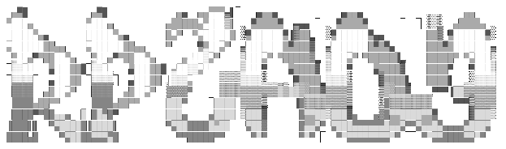

---

RP2A03 Synth is a WiP NES VST3/CLAP plugin for modern DAWs. The goal is to create a modernized, high-performance synthesizer partially focusing on faithful, hardware-accurate RP2A03 APU behavior, ease of use, and future support for NES expansion audio chips.

## Workspace Structure

```
RP2A03-SYNTH/
├── rp2a03_core/
|   ├── apu.rs
│   ├── apu_pulse.rs
│   ├── apu_triangle.rs
│   ├── apu_noise.rs
│   ├── software_lfo.rs
│   ├── blip_buf.rs
│   ├── sequencer.rs
|   └── lib.rs
├── rp2a03_common
│   ├── gui/
│   │   ├── mod.rs
│   │   ├── state.rs
│   │   ├── editor.rs
│   │   ├── theme.rs
│   │   └── widgets.rs
│   ├── midi/
│   │   ├── mod.rs
│   │   ├── handler.rs
│   │   ├── events.rs
│   │   ├── types.rs
│   │   └── tests.rs
│   └── lib.rs
├── rp2a03_niceplug/
│   └── lib.rs
└── rp2a03_fl/ - Soon!
    └── lib.rs
```

---

## Building

**Prerequisites**: Rust toolchain (stable, 2021 edition).

Build the entire workspace (release):

```bash
cargo build --release
```

Build only the plugin crate:

```bash
cargo build --release -p rp2a03_niceplug
```

Release artifacts and bundled plugin outputs will be located in `target/bundled/` and `target/release/`.

---

## Credits & Attribution

This synthesizer relies on foundational open-source code and deep research into NES APU behavior, emulation, and tracker design. We gratefully acknowledge the authors and projects below:

### APU Architecture & DSP Reference

* **[TetaNES](https://github.com/lukexor/tetanes)** (License: **MIT / Apache 2.0**)
  * *Author*: Luke Petherbridge
  * *Contribution*: The core APU channel structure, pulse timer, envelope, and frame counter implementations in `rp2a03_core` were adapted and referenced from TetaNES's core APU module.

---

### Reference Architecture

The following projects were extensively referenced during research/development:

* **[FamiStudio](https://famistudio.org/)** / **[FamiStudio GitHub](https://github.com/BleuBleu/FamiStudio)** (License: **MIT**)
* **[Dn-FamiTracker](https://github.com/Dn-Programming-Core-Management/Dn-FamiTracker)** (License: **GPL-3.0-or-later**)
* **[Furnace Tracker](https://github.com/tildearrow/furnace)** (License: **GPL-2.0-or-later**)
* **[Mesen / MesenCE](https://github.com/nesdev-org/MesenCE)** (License: **GPL-3.0-or-later**)
* **[puNES](https://github.com/punesemu/puNES)** (License: **GPL-2.0-or-later**)
* **[NesDEV and its community](https://www.nesdev.org/wiki/Nesdev_Wiki)**

---

## License

Original code written specifically for this project is released under the **WTFPL** (Do What The Fuck You Want To Public License). 

Code adapted from upstream open-source projects continues to retain and respect their original permissive/open licenses (e.g. TetaNES and Dn-FamiTracker).

```text
            DO WHAT THE FUCK YOU WANT TO PUBLIC LICENSE
                    Version 2, December 2004

 Copyright (C) 2026 Purpbatboi

 Everyone is permitted to copy and distribute verbatim or modified
 copies of this license document, and changing it is allowed as long
 as the name is changed.

            DO WHAT THE FUCK YOU WANT TO PUBLIC LICENSE
   TERMS AND CONDITIONS FOR COPYING, DISTRIBUTION AND MODIFICATION

  0. You just DO WHAT THE FUCK YOU WANT TO.
```

---

## AI Disclosure

OpenAI's Codex and Google Antigravity AI agents were used in the development of this plugin.