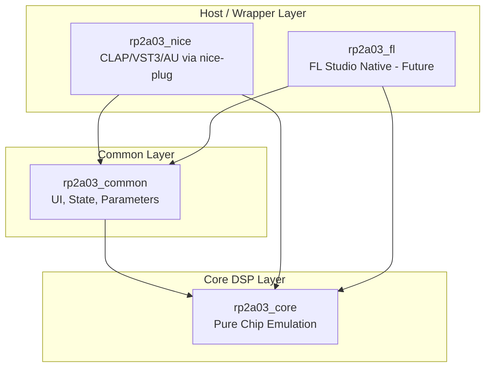

# RP2A03 Synth Project Structure & Scope Outline

This document defines the architecture, scope, and technical roadmap for the **RP2A03 Synth** project. The goal of this project is to build a high-fidelity, band-limited, retro-emulator synthesizer plugin that models the NES sound chips and popular expansion hardware.

---

## 1. Crate Architecture & Separation of Concerns

The workspace is organized into separate crates to enforce a strict boundary between the pure emulation/DSP code and the plugin wrapper frameworks.

### 📦 `rp2a03_core`
- **Responsibility**: Pure emulation and digital signal processing (DSP) of the NES APU and audio expansion chips.
- **Constraints**:
  - Must remain completely **dependency-free** of any plugin host, wrapper framework (e.g., `nice-plug`), or UI package (e.g., `egui`).
  - Driven strictly via simulated hardware register writes (matching 2A03 registers `$4000`–`$4017`, VRC6 registers, etc.) and cycle-stepping.
  - Does **not** handle MIDI notes, velocities, CCs, voice allocation, or polyphony.
  - Implements band-limited synthesis (via `blip_buf` integration) to eliminate high-frequency aliasing.

### 📦 `rp2a03_common`
- **Responsibility**: Shared components, presets, parameters, and UI logic.
- **Contents**:
  - `egui`-based UI elements (main control panels, visualizers, etc.).
  - Custom UI widgets (e.g., retro knobs, sliders, waveform displays).
  - Presets and configuration serialization/deserialization.
  - Parameter wrangling: Translating unified plugin parameter values (0.0 to 1.0 or custom ranges) into a format easily digestible by the core and UI.

### 📦 `rp2a03_nice`
- **Responsibility**: Standard industry plugin formats (VST3, CLAP, and AU) built using the `nice-plug` framework.
- **Contents**:
  - Translates incoming MIDI notes, velocities, and controllers into the corresponding register writes on the emulation core.
  - Manages voice state and notes (e.g., tracking when key is held down to generate envelopes).
  - Bridges the shared UI (`rp2a03_common`) to `nice-plug`'s editor system.

### 📦 `rp2a03_fl` (Future/Planned)
- **Responsibility**: Native FL Studio plugin wrapper.
- **Contents**:
  - Integrates with the FL Studio Native SDK.
  - Reuses the shared core DSP (`rp2a03_core`) and shared UI logic/state (`rp2a03_common`).

---

## 2. Audio Core Scope & Features

The audio core is planned to model the original Famicom/NES sound architectures.

### 🎮 RP2A03 (Standard NES APU)
- **Pulse 1 & 2**:
  - Duty cycles: 12.5%, 25%, 50%, 25% negated.
  - Volume envelope generator.
  - Frequency sweep unit (Pulse 1's sweep subtracts one extra due to one's-complement logic; Pulse 2 uses two's-complement).
  - Length counter.
- **Triangle**:
  - 32-step triangle wave.
  - Linear counter and length counter.
- **Noise**:
  - 32,767-bit pseudo-random sequence generator.
  - Periodic noise mode ("metallic" loop mode using 93-bit sequence).
  - Volume envelope and length counter.
- **DPCM (Delta Pulse Code Modulation)**:
  - 1-bit delta coding playback.
  - Custom sample loading (WAV or RAW conversion into 1-bit samples).
  - Playback loop, rate tables.

### ⚡ Expansion Audio (In-Scope / Planned)
- **Konami VRC6**:
  - 2x Pulse channels with 8-step duty cycles (variable width: 1/16 to 8/16).
  - 1x Sawtooth channel (7-step accumulator).
- **Sunsoft 5B / YM2149**:
  - 3x Square wave channels.
  - Common noise generator.
  - Envelope generator (standard 3-channel SSG functionality).
- **Namco 163**:
  - 1 to 8 wavetable channels.
  - Custom waveforms stored in internal RAM.
- **Famicom Disk System (FDS)**:
  - 1x Wavetable channel.
  - Frequency modulation (built-in LFO modulating the main wavetable frequency).

---

## 3. MIDI and Voice Routing Design

Rather than forcing the user to program entire songs inside a single, complex multi-timbral instance (which is a **non-goal** for this project), the plugin is designed to be loaded in **multiple instances** across separate tracks in a DAW (e.g., one instance for Pulse 1, one for Triangle, one for Noise, and another for expansion chips). 

To support both classic monophonic emulation and modern synthesizer workflows, each instance will support two routing modes:

### 🎹 Monophonic Mode (Selected Channel)
- The plugin behaves as a single monophonic synth voice.
- The user selects a specific emulation channel (e.g., 2A03 Square, 2A03 Triangle, VRC6 Sawtooth).
- MIDI events directly drive a single instance of that emulation channel's registers.

### 🎼 Polyphonic Mode (Synth-Style Allocation)
- The plugin behaves as a standard polyphonic synthesizer.
- Multiple instances of the selected emulation channel/sub-system are instantiated under the hood.
- Incoming polyphonic MIDI notes (chords) are dynamically voice-allocated across a pool of these channel instances, enabling polyphony for classic NES waveforms (e.g., playing a 4-voice polyphonic pad using the 2A03 Square wave engine).
- **Voice Limit Setting**: Features a user-configurable parameter to control the voice allocation limit (e.g., 2 to 16 voices). This enables fine-grained control over CPU utilization and chord density.

### 🚫 Non-Goals / Out-of-Scope
- **Single-Instance Multi-Timbral Routing**: The plugin will not support mapping different MIDI channels to different physical APU channels (e.g., MIDI Ch 1 to Pulse 1, MIDI Ch 2 to Pulse 2) within a single instance. Multi-channel arrangements should be handled at the DAW level by loading multiple plugin instances.

---

## 4. UI/UX & Styling Guide

- **Theme**: High-fidelity dark mode with retro-futuristic details.
- **Aesthetic**:
  - Visual color hierarchy based on NES console colors (retro grey, crimson red, dark charcoal, bright white).
  - Clean and responsive layout using `egui`.
- **Custom Components**:
  - Graphic knobs mimicking hardware knobs.
  - Real-time oscilloscope / visualizer showing the active channel's waveform.
  - Interactive chip routing view (showing active channels and signals).

---

## 5. Development Roadmap

1. **Phase 1: Basic 2A03 Synth (In Progress)**
   - Complete Pulse, Triangle, and Noise DSP.
   - Core `blip_buf` integration.
   - Monophonic CLAP/VST3 plugin wrapper with basic editor GUI.
2. **Phase 2: Complete the 2A03 APU**
   - Implement the DPCM channel.
   - Refine sweeps, envelopes, and timing precision.
3. **Phase 3: Shared Common Infrastructure**
   - Standardize parameter serialization and loading.
   - Build a robust preset system in `rp2a03_common`.
   - Polish GUI widgets (knobs, style details).
4. **Phase 4: Expansion Chip DSP**
   - Add VRC6, FDS, 5B, and N163 modules to `rp2a03_core`.
   - Update parameter wrapping and GUI views to support selecting expansion modes.
5. **Phase 5: Polyphony & Voice Allocation**
   - Implement dynamic voice allocation for Polyphonic Mode.
   - Add voice count configuration and poly/mono toggle controls to the UI.
6. **Phase 6: FL Studio Native Version**
   - Build the `rp2a03_fl` crate using the native SDK.
